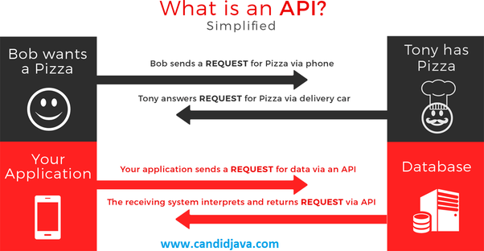

# Fetch the Dogs

**Note: This exercise uses the repo from our last exercise where we added the slideshow to a landing page. You do not need to clone this repo. There will also be lots of reading in this lesson, so strap in.**

### Fetch Data

One of the most valuable tools you can have as a software developer is the ability to pull information from different websites and services and present that data in your own applications. In this lesson, we're going to introduce you to API's (Application Program Interface) and how you can write code to request data from different services. Let's get started! 

### What is an API?

Take a look at this diagram: 



Back in the day when you were a kid and your parents were ordering pizza for dinner, they used to pick up the phone and call the local pizza place. Before making the call, they would look at the menu and see what kind of pizzas they could *request* from the pizza place. Then, they would call and *request* a certain size and type of pizza. 

The local pizza place would *respond* by sending a delivery person to your door with the pizza you requested. 

This is exactly how API's work. A company's API is like a restaurant's menu in this scenario. The pizza place creates a set of rules for what you can order from the restaurant. They make certain items available, and certain items are not. AKA if you were trying to order 5lbs of salt, even if the pizza place has it, they likely won't deliver that to you. 

Software companies work the same way. Twitter has a vast amount of data, ranging from people's emails and phone numbers to their public/private tweets. Twitter gets to decide what it shares with different applications, and builds APIs (like restaurant menus) to give developers like you and me the ability to access some of their data so we can build apps that allow you to login through Twitter or show tweets in your app. 


### So how exactly do APIs work when we're talking about code and not pizza? 

You, as a developer, decide you want to show some tweets in your app. You go to the Twitter Developer's Portal and they give you what is called an API Key, which is just a really long string of characters. You send this API Key to Twitter any time you send a *request* for data, so Twitter knows it is you asking for the data. You tell Twitter in your *request* exactly what data you want, and if you're allowed to access that data, Twitter *responds* back to you so you can present it in your website!


### Okay cool. Show me how to do that.

In JavaScript there are a few different ways we can use to send requests to get data from different services – what we're going to use is called AJAX. You can find more information [here](http://api.jquery.com/jquery.ajax/), though I'm going to walk you through it. 

1. All of our AJAX will be written in our JavaScript file, so let's open up the script.js and inside our `$(document).ready` function let's run `console.log("Page loaded");` to make sure everything is working correctly.

1. If all is well, let's start requesting some important data from a very valuable source: www.dog.ceo!

1. We're going to be sending requests to dog.ceo to receive urls linking to images of adorable dogs. The first thing we should do is create a variable called `request` and set it equal to our request. The way we build a request in AJAX is like this: 
```
  var request = $.ajax({
    url: "https://dog.ceo/api/breeds/image/random",
    method: "GET",
  });
```

Let's break this down: 
- We see the dollar sign – do you remember what that means? It means "jQuery". The dollar sign before the word `ajax` is a shorthand way to make AJAX requests. Every AJAX request needs at least 2 pieces of data: (1) the URL to send the request and (2) the "method" or type of request you are making. 

- There are quite a few request methods, but the two we will be focusing on are: 
GET
POST

- A "GET" request means you want to get data from the service you are sending the request to. You'll see in the example, we want to get an image of a dog from www.dog.ceo, so we use a "GET" request. 

- A "POST" request means you want to give (or post) data to the service. An example of this would be if you created a website that you could tweet from, and you needed to give (or post) your tweets to Twitter so that they would show up in your feed. 

**You may have noticed** that we don't have an API Key for www.dog.ceo. Since none of its data is private and everyone can access the same data, there's no need for an API Key. 

1. Okay so now let's copy/paste that request code above into our script.js file. That code will send a GET request, but that doesn't do us much good unless we can receive the response. 

1. Add this code below our request code to receive the response:
```
  request.done(function( response ) {
    console.log("here is the response", response)
  });
```

You'll notice we're calling the `done` function on our request. This code executes when we receive the response from the server. In the same way that it takes awhile after you call for your pizza to arrive, it takes some time after you request data for that data to arrive. Inside of our `done` function, let's `console.log` the response we received from www.dog.ceo. 

1. Click the arrow of the response that was printed in the console, and you'll see the response has two attributes: (1) message and (2) status. 

1. The status just tells us whether the request was successful, and the response is the URL to the V important dog image. Copy/paste that URL into a new Chrome tab to see our dog image. 

1. Now, that all worked perfectly, but I know enough about code to realize that things break...often. What happens if the request fails? Good question! AJAX provides a handy way for us to handle failed requests. Just like we have the `done` function that runs when the request finishes, we can create a `fail` function to handle any failures.

```
  request.fail(function( requestObject, textStatus ) {
    alert( "Request failed: " + textStatus );
  });
```

1. Add in the `request.fail` code below our `done` code and then change the URL in the GET request so that it's pointing to `"https://dog.ceo/api/breeds/image/rando"` *Instead of requesting a "random" dog, we are now requesting a "rando" dog. We have gone "off menu"*

1. Refresh the browser and watch it fail. You should see an alert. 

---
**Thanks for reading all that. Let's write some code**

### So what can I do with some random dog URLs?

1. Using some of our jQuery skills that we've acquired in the past (particularly in [NashWD-4E](https://github.com/codebug-us/NashWD-4E), let's replace the first `img` tag in our slideshow with an `img` tag that links to our dog url from the www.dog.ceo API! **HINT** Your code that replaces the HTML will all need to be inside the `done` function. 

1. Nice work on that last one. Now, let's see if instead of replacing the first image, you can append our random dog image to the end of the slideshow. What I mean by that is that when I click the arrows on the right side, at some point your random dog image should appear.

1. When we look through the www.dog.ceo [documentation](https://dog.ceo/dog-api/documentation/random), you'll see there are other requests we can make. See if you can figure out how to get 3 different random dog images (using only 1 request), and loop through them, appending each one to the slideshow. 

